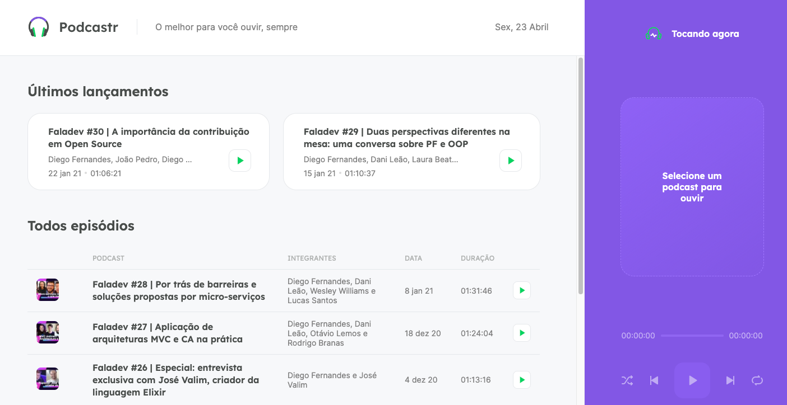

  <h1>  Podcastr - #NLW 5 </h1>
  <h2> Streaming de áudio para podcasts desenvolvido pela Rocketseat </h2>
  <h4> Audio streaming for podcasts developed by Rocketseat </h4>
   
  
   

Esse sistema foi desenvolvido em um evento promovido pela [Rocketseat]('https://nextlevelweek.com/').
Trata-se de uma aplicação que usa um _'fake server'_ com dados relevantes e link do podcast para servir de api para o app.

### Ferramentas usadas:

- NextJS
- TypeScript
- Axios
- Sass
- date-fns
- rc-slider

### Funcionalidades implementadas:

Foi implementado o necessário para um player de áudio, apenas: _play, pause, shuffle, repeat_

### Para executar:

- yarn install
- yarn server
- yarn dev

### Pontos para melhorar:

- Responsividade
- PWA
- tema dark
